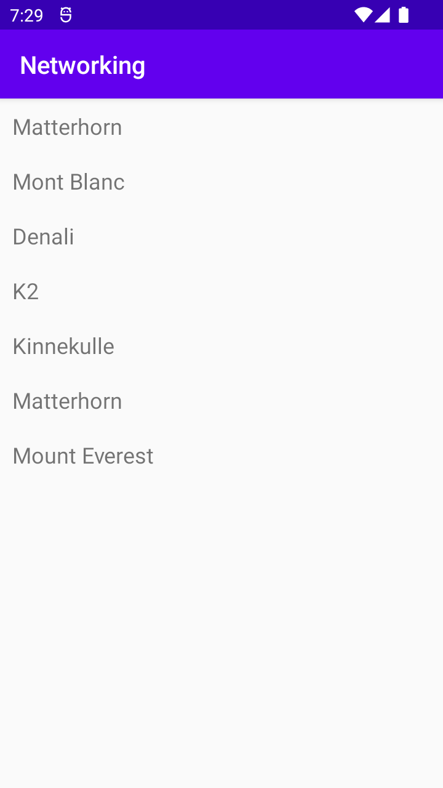

# Rapport
Det har skapats en recyclerview layout, etfer dettaskapades klassen mountain för att kunna göra krav 2 som var att lägga till en arraylista i mainactivity.java. Det skapades en adapter rakt av lenasyskod. Kodsnutten nedan visar hur jsondatan från länken användes för att visas i recycler viewn med hjälp av adaptern. Texten som visas är berg från en array med objekt i.
```
public class MainActivity extends AppCompatActivity implements JsonTask.JsonTaskListener {

    private Gson gson;
    private final String JSON_URL = "https://mobprog.webug.se/json-api?login=brom";
    ArrayList<Mountain> items = new ArrayList<>();
    ArrayList<RecyclerViewItem> recyclerItems = new ArrayList<>();
    RecyclerViewAdapter adapter;

    @Override
    protected void onCreate(Bundle savedInstanceState) {
        super.onCreate(savedInstanceState);
        setContentView(R.layout.activity_main);
        gson = new Gson();

        items.add(new Mountain("Matterhorn"));
        items.add(new Mountain("Mont Blanc"));
        items.add(new Mountain("Denali"));

        for(int i=0; i<items.size(); i++){
            Log.d("Unique ID", items.get(i).toString()+" hej");
            recyclerItems.add(new RecyclerViewItem(items.get(i).toString()));
        }
        adapter = new RecyclerViewAdapter(this, recyclerItems, new RecyclerViewAdapter.OnClickListener() {
            @Override
            public void onClick(RecyclerViewItem item) {
                Toast.makeText(MainActivity.this, item.getTitle(), Toast.LENGTH_SHORT).show();
            }
        });

        RecyclerView view = findViewById(R.id.recycler_view);
        view.setLayoutManager(new LinearLayoutManager(this));
        view.setAdapter(adapter);

        new JsonTask(this).execute(JSON_URL);
    }

    @Override
    public void onPostExecute(String json) {
        Log.d("===>", json);
        Type type = new TypeToken<List<Mountain>>() {}.getType();
        List<Mountain> listOfMountains = gson.fromJson(json, type);
        items.clear();
        items.addAll(listOfMountains);
        for(int i=0; i<items.size(); i++){
            Log.d("===>1111", items.get(i).toString()+" hej");
            recyclerItems.add(new RecyclerViewItem(items.get(i).toString()));
        }
        adapter.notifyDataSetChanged();
    }
}
```

